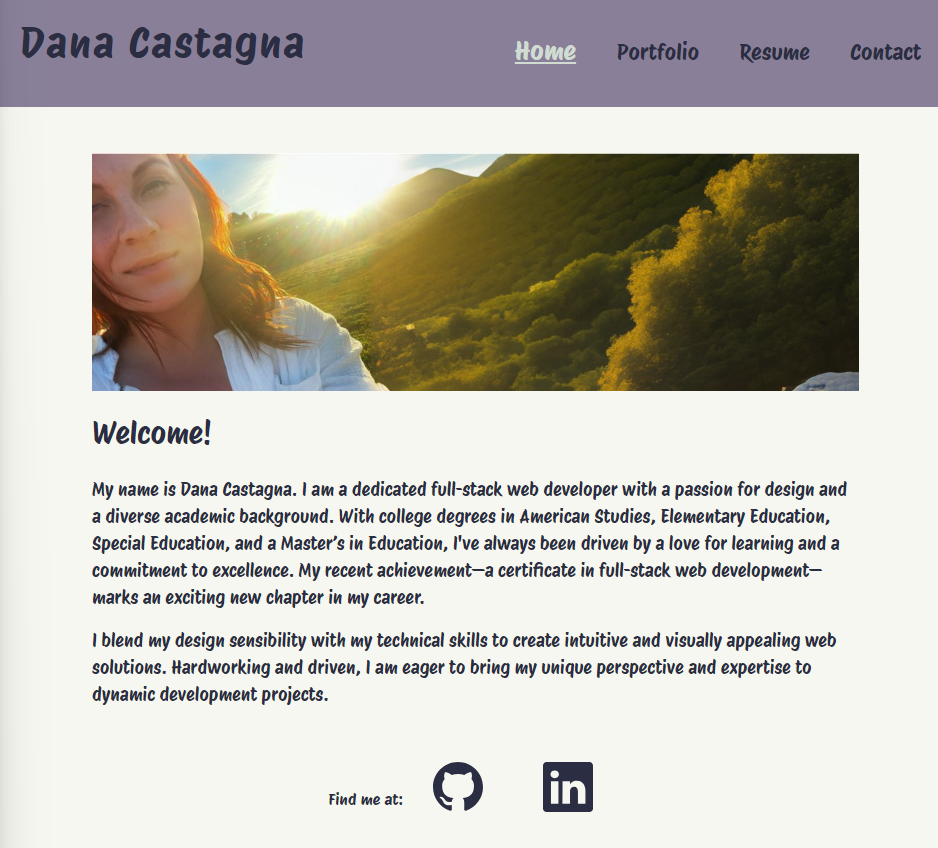
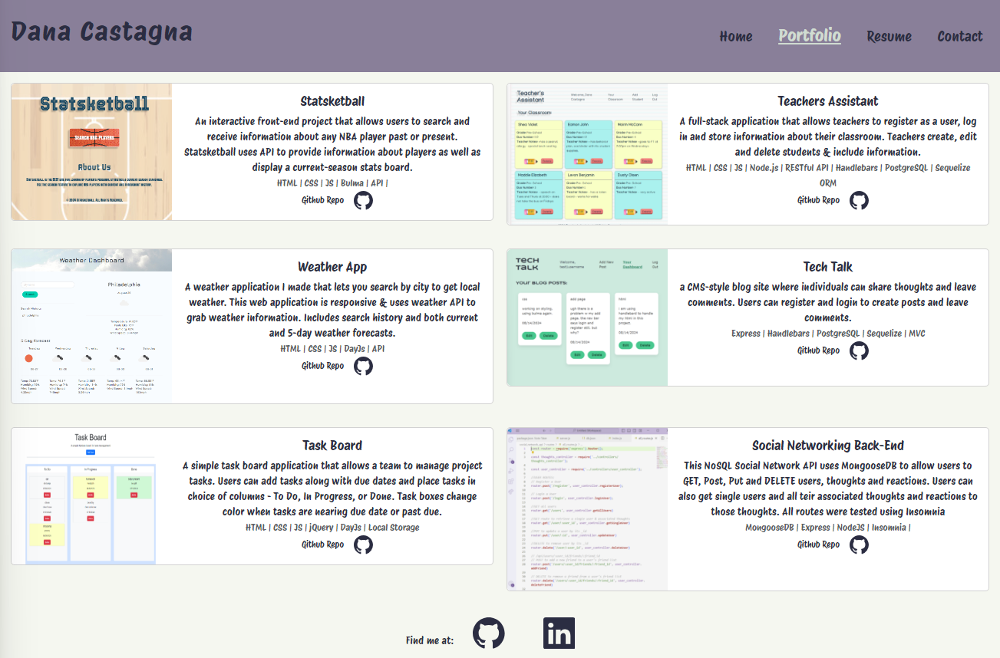
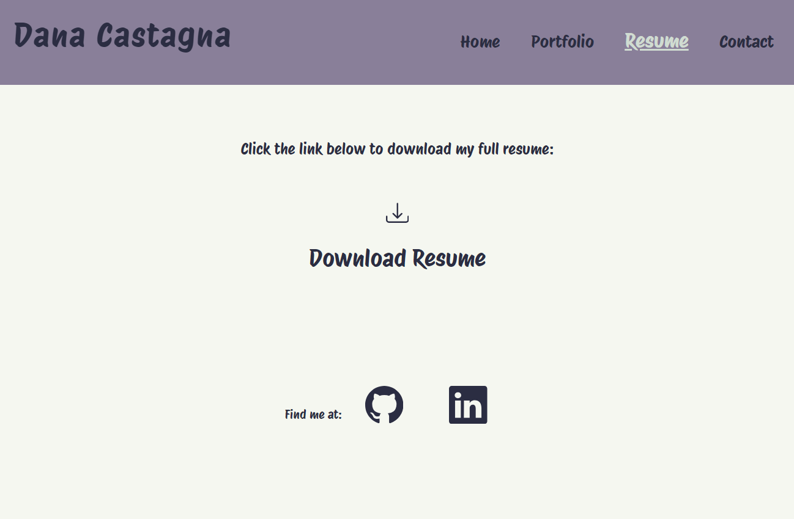
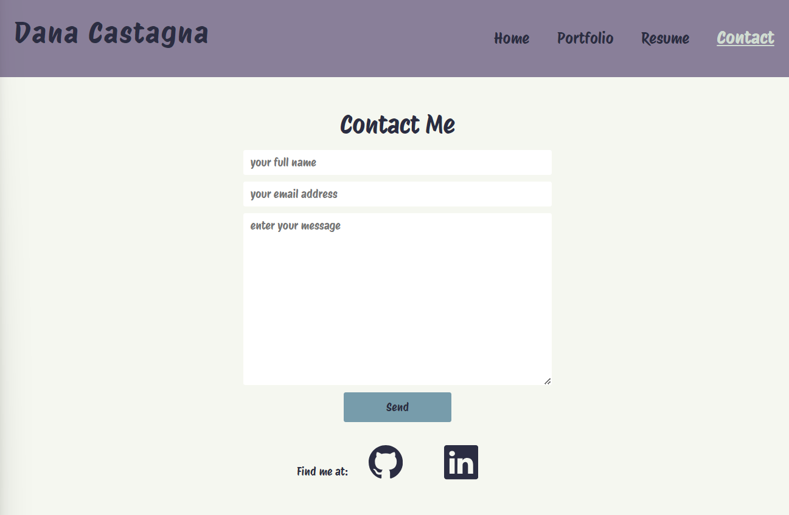
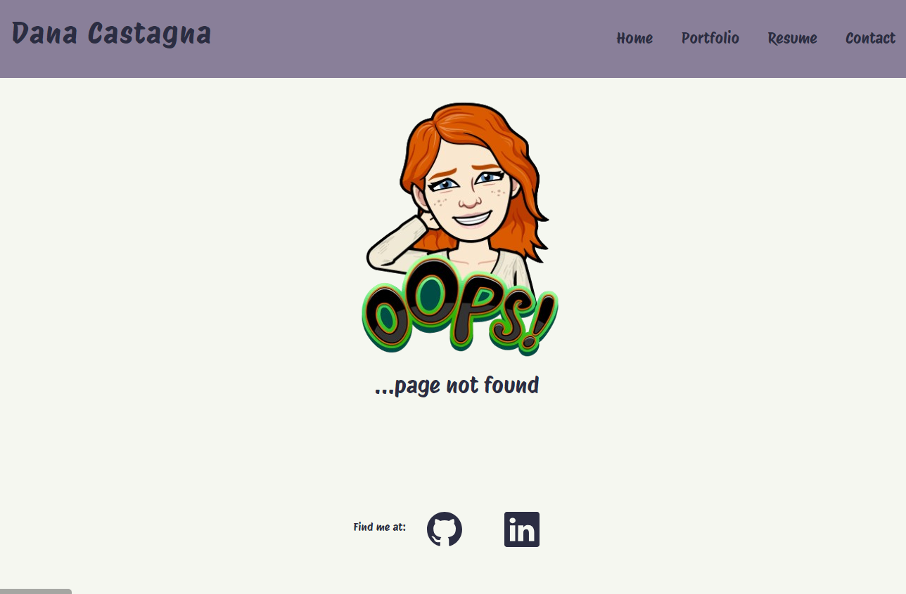

# Personal Portfolio

## Description

This asite was built using React and serves as a personal professional portfolio.  It has a main page that gives info about developer along with a picture.  The header appears on all pages and allows users to navigate between pages: home, portfolio, remsume and contact.  The footer also appears on all pages and include links to the developers Github and LinkedIn profiles.

The portfolio page includes examples of the developer's projects and other works completed.  Each card contains an image along with a description and a list of technologies used as well as a link the the github repo.The Resume page includes a downloadable link to the developer's portfolio.  The contact page alloes users to comminucate directly with the developer by using Web3Forms. Finally a NotFound page appears when users try to navigate to an unknown page.

## Installation 

"scripts": {
    "dev": "vite",
    "build": "vite build",
    "lint": "eslint .",
    "preview": "vite preview"
}

## Usage

deployed website: https://tech-blog-bato.onrender.com

## Testing

this back-end's routes were tested on Insomnia 9.3.2.

## Credits

coded and designed by Dana Castagna

with assistance from Xpert Learning Assistant & tutoring from edX Boot Camps LLC.

© 2024 edX Boot Camps LLC.

This template provides a minimal setup to get React working in Vite with HMR and some ESLint rules.

Currently, two official plugins are available:

- [@vitejs/plugin-react](https://github.com/vitejs/vite-plugin-react/blob/main/packages/plugin-react/README.md) uses [Babel](https://babeljs.io/) for Fast Refresh
- [@vitejs/plugin-react-swc](https://github.com/vitejs/vite-plugin-react-swc) uses [SWC](https://swc.rs/) for Fast Refresh

## License
MIT License

Copyright (c) 2024 Dana Castagna

Permission is hereby granted, free of charge, to any person obtaining a copy
of this software and associated documentation files (the "Software"), to deal
in the Software without restriction, including without limitation the rights
to use, copy, modify, merge, publish, distribute, sublicense, and/or sell
copies of the Software, and to permit persons to whom the Software is
furnished to do so, subject to the following conditions:

The above copyright notice and this permission notice shall be included in all
copies or substantial portions of the Software.

THE SOFTWARE IS PROVIDED "AS IS", WITHOUT WARRANTY OF ANY KIND, EXPRESS OR
IMPLIED, INCLUDING BUT NOT LIMITED TO THE WARRANTIES OF MERCHANTABILITY,
FITNESS FOR A PARTICULAR PURPOSE AND NONINFRINGEMENT. IN NO EVENT SHALL THE
AUTHORS OR COPYRIGHT HOLDERS BE LIABLE FOR ANY CLAIM, DAMAGES OR OTHER
LIABILITY, WHETHER IN AN ACTION OF CONTRACT, TORT OR OTHERWISE, ARISING FROM,
OUT OF OR IN CONNECTION WITH THE SOFTWARE OR THE USE OR OTHER DEALINGS IN THE
SOFTWARE.

## Features

- about-me info 
- portfolio page with project and work item examples 
- links to developer profiles & repos
- downloadable resume
- working contact form
- mobile-first responsive styles